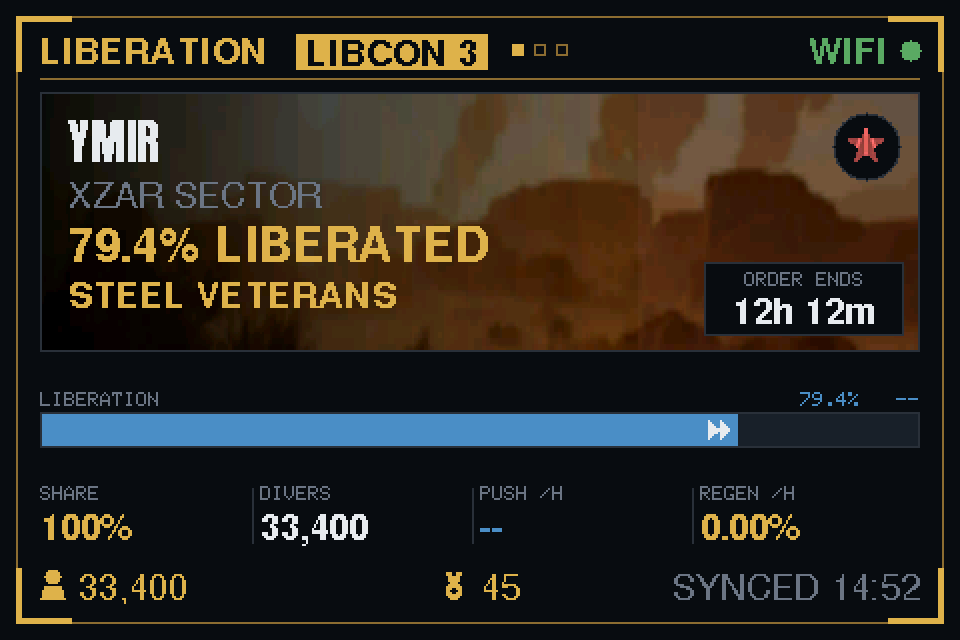

# Helldivers 2 — Major Order Desk Monitor

A standalone, always-on desk display that shows the current Helldivers 2 Major
Order: the target planet, its liberation percentage, time remaining, and live
player counts. It polls [api.helldivers2.dev](https://api.helldivers2.dev)
every five minutes and draws a Super Earth command-terminal HUD on a 4"
480x320 LCD.

Each card is built around the target's biome, with the planet's identity set
over the artwork and the progress tracks beneath it. When an order names
several planets the card cycles through them; when there is **no** order the
same card shows the five busiest liberation campaigns in the galaxy instead,
so the screen is never idle while the war is on.

It also speaks. A new Major Order, or a firmware update landing overnight,
plays a short clip through the board's speaker — see [Audio](#audio).

Read-only. No touch interaction, no buttons — plug it in, join it to WiFi once,
and it runs. It updates its own firmware from this repo's GitHub Releases, so
USB is only needed for the first flash — see
[Firmware updates](#firmware-updates).



> The image above is generated by `tools/preview.sh`, which compiles the
> firmware's own renderer on the host and rasterises it. See
> [Off-target preview tools](#off-target-preview-tools).

---

## Hardware

| | |
|---|---|
| Board | Hosyond 4.0" ESP32-32E display module (LCDwiki `E32R40T`) |
| MCU | ESP32-D0WD-V3, dual core, **no PSRAM**, 520 KB SRAM, 4 MB flash |
| Panel | ST7796S, 320x480 native, driven at rotation 1 → **480x320 landscape** |
| Touch | XPT2046 resistive — wired but **unused** |
| Audio | GPIO26 (internal DAC) → FM8002E amp, GPIO4 enable (active low), 2-pin JST speaker header |
| Storage | Onboard MicroSD slot on VSPI (SCK 18, MISO 19, MOSI 23, CS 5). Optional — see [SD card](#sd-card). |
| Power | USB-C, 5 V. No battery circuitry. |

### Pin mapping — ⚠️ verify this first

The pin definitions live in **`platformio.ini`** under `build_flags`, not in a
TFT_eSPI `User_Setup.h`. Nothing in the library folder needs editing.

```ini
-D TFT_MISO=12
-D TFT_MOSI=13
-D TFT_SCLK=14
-D TFT_CS=15
-D TFT_DC=2
-D TFT_RST=-1     ; panel reset tied to the ESP32 EN line
-D TFT_BL=27
-D TOUCH_CS=33    ; XPT2046, unused in v1
-D USE_HSPI_PORT=1
```

**Source:** these are the published pins for the LCDwiki `E32R40T` 4.0-inch
ESP32-32E display board — <https://www.lcdwiki.com/4.0inch_ESP32-32E_Display> —
which is the module Hosyond resells. They were cross-checked against the
[ESP32-Cheap-Yellow-Display](https://github.com/witnessmenow/ESP32-Cheap-Yellow-Display)
community pinouts for the ST7796S variants of that family, which use the same
HSPI arrangement.

Hosyond does not publish its own datasheet, so **this mapping is unverified
against a physical board.** Before assuming the firmware is broken, check:

1. **Blank screen, backlight on** → the SPI pins are probably right but the
   driver may not be. Try `ST7789_DRIVER` or `ILI9488_DRIVER`.
2. **Blank screen, backlight off** → `TFT_BL` is wrong. It is the single most
   likely pin to differ. Try 21 or 22.
3. **Garbage / torn output** → drop `SPI_FREQUENCY` to `27000000`, then
   `20000000`.
4. **Nothing at all** → remove `-D USE_HSPI_PORT=1`. Some revisions of this
   board are wired to VSPI (18/19/23/5) instead of HSPI (12/13/14/15).
5. **Mirrored or upside-down** → change `setRotation(1)` to `setRotation(3)` in
   `src/hud_renderer.cpp` (`HUDRenderer::begin()`).

Compare against the silkscreen on the back of the board and the ribbon
connector before changing anything else.

> `GPIO12` (MISO) is the ESP32 `MTDI` strapping pin, which selects flash
> voltage at boot. It is vendor-wired here and must not be repurposed. If the
> board fails to boot with a peripheral attached, this is why.

---

## Build and flash

Requires [PlatformIO Core](https://docs.platformio.org/en/latest/core/installation/).

```bash
pip3 install --user platformio
export PATH="$HOME/Library/Python/3.9/bin:$PATH"   # macOS; adjust for your Python

git clone https://github.com/codydoerfler/hd2-desk-monitor.git
cd hd2-desk-monitor

pio run                 # build
pio run -t upload       # build + flash over USB-C
pio device monitor      # serial log @ 115200 baud
```

Everything — platform, board, libraries, display config — is pinned in
`platformio.ini`. The first build downloads the toolchain and libraries
(a few minutes); later builds take seconds.

Resource usage as built: **RAM 16.6 % (54,320 bytes static)**, **Flash 95.4 %
(1,938,141 of 2,031,616 bytes)**.

That flash figure is high because the partition table splits the 4 MB into
**two 1.9375 MiB app slots**, which is what [OTA](#firmware-updates) needs: the
running image stays put while an update is written into the other slot.

This used to be the stock `min_spiffs.csv`. Adding the SD/FAT stack pushed its
1.875 MiB slots to 98.5 %, so the project now carries its own
`partitions_hd2.csv`, which drops that table's 128 KB SPIFFS partition — never
mounted here, and now genuinely obsolete since new assets live on the
[SD card](#sd-card) rather than in flash — and gives 64 KB of it to *each* app
slot.

> ⚠️ **A unit already in the field needs one USB reflash to actually get that
> room.** An OTA writes the app slot and nothing else; the partition table
> lives at `0x8000` and is only rewritten by a full USB flash. A device still
> running the old layout keeps its 1.875 MiB slots until then. That is safe —
> the OTA fails cleanly if an image will not fit — but the headroom below is
> only real once the unit has been flashed over USB once.

> ⚠️ **Roughly 95 KB of headroom, and assets are what eat it.** The next
> substantial addition to `hud_biomes.h`, `hud_icons.h` or `hud_audio_clip.h`
> may not fit; the failure mode is a link error, not something subtle. New art
> and audio belong on the SD card now. The stock `huge_app.csv` is not an
> option any more; it has only one app slot and would silently take OTA away.

---

## First boot — WiFi setup

No credentials are compiled in. On first boot (or if the saved network is
gone), the device starts a [WiFiManager](https://github.com/tzapu/WiFiManager)
captive portal and shows setup instructions on screen:

1. From a phone or laptop, join the WiFi network **`HD2-Monitor`**,
   password **`helldive`**.
2. A configuration page should open automatically. If it doesn't, browse to
   **`http://192.168.4.1`**.
3. Pick your home network and enter its password.
4. Fill in **UTC offset in hours** with your timezone — see
   [Local time](#local-time) below. Leave it at `0` to display UTC.
5. Save. The device reboots, connects, and starts polling.

Credentials and the offset are stored in the ESP32's NVS flash and survive
power cycles.

If nobody configures it within **5 minutes**, the portal times out and the
device reboots — so an unattended unit recovers on its own after a router
outage rather than sitting in AP mode forever.

The portal SSID, password and timeout are in `src/config.h`:

```cpp
static const uint32_t kPortalTimeoutS = 300;
static const char *kPortalSsid = "HD2-Monitor";
static const char *kPortalPass = "helldive";
```

> The SSID is deliberately short — it is rendered at full size in the on-screen
> setup box. A longer name auto-shrinks to a smaller font; much longer and it
> will clip. `tools/check_layout.py` will tell you.

**To wipe stored WiFi credentials**, uncomment `wm.resetSettings();` in
`setup()` in `src/main.cpp`, flash once, then comment it out and flash again.
Or erase the whole flash: `pio run -t erase`.

---

## Configuration

### ⚠️ Set a real contact header before running this long-term

The Helldivers 2 community API requires every request to identify its caller.
Both headers are sent on every request; the API returns HTTP 400 without them.

```ini
# platformio.ini
-D HD2_CLIENT_HEADER='"hd2-desk-monitor"'
-D HD2_CONTACT_HEADER='"https://github.com/your-user/hd2-desk-monitor"'
```

`HD2_CONTACT_HEADER` currently holds a **placeholder**. Replace
`your-user` with your actual GitHub handle, or use an email address, so the
API maintainers can reach you if this client misbehaves. This is the courtesy
that keeps a free community API open.

### Local time

The device clock runs on UTC. A fixed offset is applied only where a **clock
time** is drawn — that is the footer, `SYNCED hh:mm` and `STALE - LAST hh:mm`.
Durations are never shifted: the Major Order countdown is a length of time, not
a wall-clock reading, so it is identical in every timezone.

Set it in the WiFi setup portal, in the **UTC offset in hours** field below the
network picker. Accepted forms:

| Typed | Means |
|---|---|
| `0` | UTC (the default on a freshly flashed unit) |
| `-6` | UTC−06:00 |
| `+1` or `1` | UTC+01:00 |
| `+5:30` | UTC+05:30 |
| `5.75` | UTC+05:45, for people who write it as a decimal |

The value is stored in NVS as a plain minute count (`hd2` / `utcOffMin`) and
survives reboots and reflashing, so it is set once and never recompiled. On a
normal boot the portal doesn't run and the saved value is used as-is; when the
portal does run, the field is pre-filled with the current setting. A value that
doesn't parse, or one outside UTC−12:00 … UTC+14:00, is logged over serial and
ignored rather than reset to UTC — a typo can't silently wipe a good setting.

**To change it later**, wipe the WiFi credentials (see above) so the portal
runs again, or set the compile-time fallback in `src/config.h`:

```cpp
static const int16_t kUtcOffsetMinutesDefault = 0;   // minutes to add to UTC
```

That constant is only the factory default used until the portal saves one; once
a value is in NVS it wins.

> **There is no DST handling, deliberately.** This is a fixed offset, not a
> timezone database — twice a year the footer will be an hour off until you
> re-enter it. Carrying the IANA rules for one `hh:mm` string on screen is not
> a trade worth making on a 4 MB part.

### Poll interval

```ini
-D HD2_POLL_INTERVAL_S=300     # 5 minutes
```

**Do not lower this below ~60 s.** The documented rate limit is 5 requests per
10 seconds, and one poll costs up to 3 requests (assignments → planet → war),
spaced 600 ms apart by `kInterRequestDelayMs`. Major Orders change on the order
of days; the only thing that moves minute to minute is the liberation
percentage. Five minutes is already generous.

Derived from this value: `kStaleAfterS = HD2_POLL_INTERVAL_S * 2` — how long
data can go unrefreshed before the footer switches to the dimmed "STALE"
treatment.

### Everything else

`src/config.h` holds the palette (`namespace theme`), the full screen geometry
(`namespace layout`), HTTP timeout, and the failure backoff bounds
(`kBackoffMinS` = 15 s, doubling to `kBackoffMaxS` = 600 s).

---

## Audio

The board drives a 2-pin JST speaker header from an FM8002E amplifier: GPIO26
carries the ESP32's **internal DAC** output and GPIO4 is the amp's enable line,
active low. There is no I2S codec on this part.

The device plays a clip on the things worth looking up for:

| Trigger | Clip | When |
|---|---|---|
| A new Major Order | card, else compiled-in | The assignment id changes between polls. Gated on having polled before, so the order already running when the board boots is not announced — otherwise every reboot and every outage would replay it. |
| The board updated itself | compiled-in | The running `HD2_FW_VERSION` differs from the one the last boot recorded in NVS (`hd2` / `fwVer`). An OTA reboots into the new image, so the *next* boot is the only moment this is detectable. A first-ever boot has nothing stored and stays silent. |

The compiled-in clip is 8-bit unsigned PCM at 8 kHz mono, stored in `PROGMEM` as
`src/hud_audio_clip.h` and played by `audio::playPcm8()`. 8 kHz is telephone
bandwidth — the lowest rate that still carries a shouted line — and at one
byte per sample it costs 8 KB per second, which is the whole reason the clip
is short. Regenerate it with:

```bash
python3 tools/gen_audio_clip.py            # rewrite src/hud_audio_clip.h
python3 tools/gen_audio_clip.py --preview  # ...and dump an ASCII waveform
```

The generator decodes `tools/assets/hellpods_source.mp3` with macOS's built-in
`afconvert`, trims the silence off both ends, normalises (the source peaks at
about half of full scale), and quantises to 8 bits.

Playback **blocks** for the length of the clip, deliberately: the HUD is a
near-static screen with nothing to animate, and the poll loop already blocks
far longer than this on its HTTP burst. A new-order alert is queued and fired
from `loop()` *after* the repaint that puts the order on screen — an alert
that finished while the panel still showed the previous card would be telling
you to look at the wrong thing.

The amplifier is left disabled whenever nothing is playing: it idles audibly
otherwise, and switching it around each clip is also what keeps the DAC's rest
voltage from thumping the cone on the way in and out.

---

## SD card

**Entirely optional.** Without a card the device behaves exactly as it always
has; the only difference is a single `[sd] no card` line in the serial log at
boot. Everything the HUD needs to draw is compiled in.

With a card, the event screens get their own audio. The board's MicroSD slot is
**already wired** — nothing to solder, no pin to free up. It sits on the
ESP32's *other* SPI peripheral (VSPI: SCK 18, MISO 19, MOSI 23, CS 5), which is
why it can be added without touching the display: TFT_eSPI owns HSPI
(12/13/14/15) and the two peripherals never see each other's traffic.

### Preparing a card

Format **FAT32** (an ESP32 will not mount exFAT, which is what macOS picks by
default for cards over 32 GB — choose "MS-DOS (FAT)" in Disk Utility). Then:

```bash
python3 tools/gen_sd_assets.py            # writes sdcard/
python3 tools/gen_sd_assets.py --preview  # ...and dumps ASCII waveforms
cp -R sdcard/ /Volumes/<CARD>/            # contents at the card's root
```

The layout the firmware looks for:

```
/audio/mo_new.wav       played when a new Major Order arrives
/audio/mo_success.wav   played when one is completed
/audio/mo_failure.wav   played when one is lost
```

Each file is optional on its own — a missing one just means that event is
silent, and the new-order case additionally falls back to the compiled-in clip.

The generator prefers a real recording at
`tools/assets/<name>_source.{mp3,wav,m4a,aif}` and converts it the same way
`gen_audio_clip.py` converts the hellpods line. With no source present it
synthesises plain terminal tones — a rising triad for success, a descending
tritone for failure — so a clean checkout produces a working card without
shipping game audio nobody can redistribute. Drop a source file in and it wins.

### What the reader will and will not play

`src/hud_storage.cpp` walks the RIFF chunk list (rather than assuming `fmt `
then `data` at fixed offsets, which a `LIST`/`INFO` chunk would turn into a
burst of noise) and accepts **uncompressed PCM, 8- or 16-bit, mono or stereo,
any sample rate**. Stereo plays the left channel only; the DAC is mono.
Anything else — ADPCM, IEEE float, MP3 renamed to `.wav` — is refused with a
named log line, because the fix for that is on the card and not in the
firmware.

Playback streams off the card in 2 KB blocks, reading one block *ahead* of the
samples being clocked out. A 2 KB read lands in a millisecond or three, which
at 125 µs per sample would otherwise be plainly audible as a click at every
block boundary.

Files are only read when an event fires. The card is not polled, not written
to, and not required to be present at boot — it can be inserted later, though
the mount is attempted once during `setup()`, so the device needs a reboot to
notice a card added while it was running.

---

## Firmware updates

The device updates itself over the internet from this repo's
[GitHub Releases](https://github.com/codydoerfler/hd2-desk-monitor/releases).
Nothing has to be running on your network, and it works from any connection
the device is plugged into — not just the one it was flashed on. USB is only
needed for the very first flash.

### How it works

**Once an hour** (`kOtaCheckIntervalS` in `src/hd2_ota.h`; first check 60 s
after boot) the device asks
`api.github.com/repos/<owner>/<repo>/releases/latest` for the newest release.
If that release's tag is a higher `MAJOR.MINOR.PATCH` than the version
compiled into the running image, it downloads the release's `firmware.bin`
asset and flashes it, then reboots into it.

Hourly rather than anything faster because no part of this is time-critical —
a Major Order display that picks up a fix within the hour is doing fine — and
each check spends one of the 60 unauthenticated requests per hour that
`api.github.com` allows per address.

Writing goes into the **inactive** app slot; the bootloader only switches over
once a complete, verified image has landed. A download that fails halfway
leaves the running firmware untouched.

The version is not a constant anyone has to remember to bump — it comes from
`git describe --tags` at build time (`tools/fw_version.py`), so a binary built
from tag `v1.2.0` reports exactly `v1.2.0`. CI asserts the two agree before
publishing, because a release whose binary disagreed with its own tag would
have every device flash, reboot, still read as out of date, and flash again.

| Situation | Behaviour |
|---|---|
| WiFi down at check time | Skipped without consuming the interval, so it checks as soon as the network is back |
| No release published yet (404) | One serial line, retry next hour |
| Release has no `firmware.bin` asset | One serial line, retry next hour |
| Release is not newer, or the tag isn't a version number | Nothing. A tag that doesn't parse as a version is never a reason to overwrite a working image |
| Image larger than the app slot | Caught *before* downloading, from the asset size in the release JSON, and logged as "the image has outgrown the partition table" |
| Download or flash fails | Old image keeps running, logged with the reason, retry next hour |

The check itself is a few KB and one TLS handshake, on its own timer in
`loop()` alongside the API poll — it never delays a poll or a repaint. The
flash *is* blocking, a couple of minutes on a slow link, so the panel shows
`Installing firmware update...` for the duration rather than looking frozen.

Watch it over serial (`pio device monitor`) — every decision prints a line
tagged `[ota]`, and the running version prints at boot as `[boot] firmware …`.

### Cutting a release

Tag and push. CI does the rest.

```bash
git tag v1.2.0
git push origin main --tags
```

`.github/workflows/release.yml` picks the tag up, builds
`hosyond-esp32-32e`, creates the GitHub Release, and attaches `firmware.bin`.
Devices are running the new image within the hour.

- Tags must look like `v1.2.0` — the workflow triggers on `v*`, and the
  device compares `MAJOR.MINOR.PATCH`, so `v1.2` or `latest` will not be
  picked up.
- Versions are compared **numerically per component**, so `v1.10.0` correctly
  beats `v1.9.0`.
- Don't mark the release a draft or a prerelease. `/releases/latest` skips
  both, so devices would never see it.
- The asset has to be named exactly `firmware.bin` (`kOtaAssetName`).
- Forking? Change `HD2_OTA_REPO` in `platformio.ini`, or your devices will
  update themselves onto this repo's builds.

A build from a working copy that isn't exactly on a tag stamps itself
`v1.2.0-4-gabc1234` and will not be overwritten by the `v1.2.0` release it
sits past — only by something genuinely newer. A build from a checkout with no
tags at all has no version to compare, and will take the first release it sees.

---

## Cards

Both card types stack the same bands, so the carousel does not reflow the
screen as it advances:

| Band | Contents |
|---|---|
| header | objective type, the LIBCON chip, carousel pips, link state |
| art | the biome plate, with the planet's name, sector and headline stat set over it, the faction mark on a dark disc top-right, and (order cards only) the order's name and a countdown plate |
| bars | one track for a liberation, two for a defence — each captioned with what it measures, its value and its measured rate |
| strip | four values: diver share, divers present, the players' push, the enemy's regen |
| footer | divers present, the order's reward, last sync |

The two differ only in how much of that budget the bars need. A defence draws
two tracks and a liberation one, so the **art absorbs the difference**
(`artOrderH` 130 vs `artCampH` 150) and the strip lands on the same row either
way. A liberation objective on an order card uses the campaign card's taller
bar, centred in the band the two tracks would have filled.

The identity sits *on* the artwork rather than above it. A left-side scrim
(`artScrimW`/`artScrimMax`) darkens the plate under the text, applied while
each pixel is already being scaled rather than as a second pass. The
alternative — a flat panel behind the words — wastes the same space the art was
given.

**The countdown has its own filled plate** at the foot of the art. That is not
decoration: the clock ticks every second, and text painted straight onto the
photograph could not be repainted without regenerating the artwork underneath
it. The plate is two stacked rows (what the clock counts down to, then the
clock) because the one-line form, `VICTORY IN 5h 41m`, is nearly twice as wide
and reaches back across the art into the headline beside it.

### Carousel

Pages advance every 7 s (`kCarouselCycleMs` in `src/hud_renderer.cpp`). An
active Major Order **owns the screen** — its targets are the only pages, and
the campaigns feed is not even fetched. High Command's orders are the point of
the device, and rotating away from them to show a planet nobody was told to
take buries the one thing that matters. With no order, the five busiest
campaigns become the carousel instead.

---

## How it works

### Modules

| File | Responsibility |
|---|---|
| `src/main.cpp` | Boot, WiFi, NTP, poll scheduling, backoff, staleness |
| `src/hd2_api.{h,cpp}` | HTTPS + JSON only. Knows nothing about drawing. |
| `src/hd2_ota.{h,cpp}` | Release check + self-flash. See [Firmware updates](#firmware-updates). |
| `src/hud_renderer.{h,cpp}` | Drawing only. Knows nothing about HTTP. |
| `src/hud_audio.{h,cpp}` | The speaker: amp enable, DAC playback. See [Audio](#audio). |
| `src/hud_storage.{h,cpp}` | The MicroSD slot: mount, WAV parse, streamed playback. See [SD card](#sd-card). |
| `src/hd2_model.h` | Plain structs passed between the two |
| `src/config.h` | Tunables, palette, layout constants |
| `src/hud_fonts.h` | Font aliases (see the warning in that file) |

`HD2Api` fills a `HudModel`; `HUDRenderer::update(model, nowUtc)` draws it.
Neither includes the other's header.

### Endpoints used

| Endpoint | Used for |
|---|---|
| `GET /api/v1/assignments` | Title, reward, expiration, target planet index (the briefing is still parsed into the model but no longer drawn) |
| `GET /api/v1/planets/{index}` | Name, sector, current owner, health/maxHealth, player count |
| `GET /api/v1/campaigns` | The five busiest liberation campaigns, **only when there is no Major Order**. Each entry embeds its planet in full, so this is one request rather than a list fetch plus per-planet lookups. |
| `GET /api/v1/war` | Total kills, mission success rate, galaxy-wide player count (the idle screen's tiles, and the diver-share column on every card) |

Each response is parsed with ArduinoJson v7 through a
`DeserializationOption::Filter`, so only the handful of fields actually used
are ever materialised. The planet document in particular is large; filtering
keeps peak heap usage well clear of what TLS needs.

### Rendering: TFT_eSPI direct, not LVGL

The brief preferred LVGL with a TFT_eSPI backend, falling back to direct
drawing if LVGL didn't fit. **It doesn't fit comfortably, so this uses direct
drawing.**

A full 480x320 16-bpp framebuffer is 307 KB against 520 KB of SRAM, most of
which is already spoken for by the WiFi stack and TLS. LVGL can work with
partial buffers, but the RAM budget stays tight and the abstraction buys
little here: the HUD is a fixed, nearly-static arrangement of text and
rectangles with no scrolling, animation, or input.

Instead the renderer redraws only what changed. A content signature string is
built from the model each frame; when it differs, the body repaints. The
countdown, WiFi indicator and footer each keep their own signature and update
independently. Each text box is composited in a small transient `TFT_eSprite`
(a few KB, freed immediately) so redraws are flicker-free without a persistent
framebuffer.

Result: 48 KB static RAM, leaving roughly 280 KB of heap for TLS (~40 KB per
connection) and sprites (~27 KB peak).

### Failure handling

| Situation | Behaviour |
|---|---|
| No active Major Order (empty array) | The five busiest liberation campaigns take over the carousel. Not treated as an error. |
| No order *and* no campaigns | Idle screen: the large Super Earth emblem, "NO ACTIVE MAJOR ORDER", and the war totals in the three tiles. |
| Multiple simultaneous orders | The first is shown. |
| Planet fetch fails, index unchanged | Previous planet data is reused. |
| War fetch fails | Previous war stats are kept; the tiles never blank. |
| API or WiFi failure | The last good data stays on screen. The footer switches to a dimmed `STALE - LAST hh:mm`. |
| Repeated failures | Exponential backoff, 15 s doubling to a 10-minute ceiling. |
| WiFi drops | Header indicator turns red `OFFLINE`; a reconnect is nudged every 15 s. |
| Captive portal ignored | Reboots after 5 minutes and retries the saved network. |

The screen is never blanked or replaced by an error message. Stale data is more
useful than no data.

### Clock

The countdown to the Major Order deadline is driven by **NTP**
(`pool.ntp.org`, `time.google.com`, `time.cloudflare.com`), not by the API.
`/api/v1/war` does return a `now` field, but it is unreliable — it currently
reports a date in 1972 — so it is ignored entirely. Expiration timestamps are
parsed from ISO 8601 with Howard Hinnant's `days_from_civil` algorithm rather
than `mktime`/`timegm`, which avoids any dependence on the device timezone.

Everything internal stays in UTC. The displayed footer time is produced by
adding the configured offset to the epoch and reading it back with
`gmtime_r()`, which yields local wall-clock time without needing a `TZ` string
or a timezone database on the device. See [Local time](#local-time).

---

## Off-target preview tools

Two tools in `tools/` let you check layout changes without flashing. Both read
the **actual** GFX font tables and `src/hud_icons.h`, so their measurements
match the device to the pixel. Run them from the project root, after at least
one `pio run` (they read `.pio/libdeps/...`).

```bash
./tools/preview.sh              # every scene -> preview_<scene>.png
./tools/preview.sh defense      # just one
python3 tools/check_layout.py   # asserts every HUD string fits its box
```

Scenes are `boot`, `defense`, `invasion`, `liberation`, `idle` and `stale`.

### How the preview works

`tools/preview.sh` compiles **`src/hud_renderer.cpp` itself** — the same file
the firmware builds — against a small host shim in `tools/preview/`, and
rasterises the result to a PNG. The shim (`tft_shim.h`, `Arduino.h`,
`TFT_eSPI.h`, `ArduinoJson.h`, `api_stubs.cpp`) implements only the surface
the renderer touches: the 2D primitives, sprites, GFX text with TFT_eSPI's own
datum and baseline maths, and Arduino's `String`.

This matters because the previews cannot drift. The tool it replaces,
`tools/preview_hud.py`, was a second hand-maintained implementation of the same
layout; it fell two commits behind the firmware and started rendering a HUD the
device no longer drew, which is exactly the kind of thing a preview exists to
prevent. Nothing in `tools/preview/` describes the layout, so there is no
second copy to keep in step.

`check_layout.py` complements it by parsing `src/config.h` directly (it used to
re-type those constants by hand, and drifted the same way). It exercises real
and worst-case strings, checks that no two rows collide, and checks that every
text row is tall enough for the glyphs it can actually draw — the bound that
catches a row clipping its own baseline.

### Icons

Every glyph on the HUD is a 1-bit bitmap in `src/hud_icons.h`, drawn with
`TFT_eSPI::drawBitmap()`. That file is generated — edit the vector shape
definitions in `tools/gen_icons.py` and re-run it rather than touching the byte
arrays:

```bash
python3 tools/gen_icons.py            # rewrite src/hud_icons.h
python3 tools/gen_icons.py --preview  # ...and dump ASCII art of each icon
```

| Icon | Size | Where |
|---|---|---|
| `emblemLarge` | 72x39 | Centrepiece on the idle and boot screens |
| `automaton` `terminid` `illuminate` | 20x20 | Faction badge |
| `target` | 20x20 | Target row — replaces the old `TARGET` text label |
| `clock` | 24x24 | Tile 1, time remaining |
| `divers` | 24x24 | Tile 2, players on the target planet / online galaxy-wide |
| `skull` | 24x24 | Tile 3, total kills |
| `check` | 24x24 | Idle tile 3, mission success rate |
| `medal` | 14x14 | Footer, Major Order reward |

The shapes are drawn at an 8x supersample and thresholded down to the target
size, so changing an icon's dimensions is a one-line edit in the `ICONS` table.
The crest and the SEAF emblem are the exception: they are cut from the source
art in `tools/assets/` by the same threshold-and-fit step (`mask_fit`) rather
than redrawn, and are letterboxed inside their slot so the artwork keeps its
own aspect ratio.

The emblem is cut at one size only. Its globe grid, laurel wreath and stars do
not survive the 1-bit reduction below roughly 40 px — the mark just reads as a
blob — so the "SUPER EARTH" header strip and the SEAF faction badge are
text-only, and the emblem appears only as the 72x39 centrepiece on the idle and
boot screens.

Between them the two tools caught six real layout bugs before any hardware
existed, including a text label whose box was 2 px too narrow, so the planet
name's background fill painted over it. If you change anything in
`namespace layout`, run both.

---

## Security notes

- `WiFiClientSecure::setInsecure()` is used — TLS is negotiated, but the
  server certificate is **not validated**. This is a read-only public API on a
  hobby device and no credentials are transmitted, so the exposure is a
  man-in-the-middle feeding you false Major Order data. To harden it, pin the
  API's root CA with `setCACert()` and add a plan to rotate it before expiry.
- **The same applies to the OTA path, where it matters more.** The releases
  API and the firmware download are fetched over unvalidated TLS, so anyone
  able to intercept the connection could serve an arbitrary image and the
  device would flash it. The bar is a man-in-the-middle on the device's own
  network or upstream of it — the same bar as the API data above, but the
  consequence is arbitrary code rather than a wrong percentage on a screen.
  The fix, if that threat model ever applies, is to pin GitHub's root CA and
  to sign the image and verify the signature before `Update.end()` — the
  transport check alone is not what makes an update trustworthy.
- WiFi credentials sit unencrypted in NVS, which is standard for ESP32
  projects and readable by anyone with physical access and a USB cable.
- The captive portal password (`helldive`) is a compile-time constant and is
  displayed on screen during setup, by design.

---

## Not implemented (deliberately out of scope)

Touch interaction · battery management · enclosure design.

Touch was built once and reverted: the XPT2046 calibration would not hold on
this panel, so swipe navigation was replaced by the timed carousel described
under [Cards](#cards). The chip select is still declared so the SPI bus stays
consistent, and `git log` has the implementation if the panel is ever swapped.

(OTA updates and audio *were* on this list. Both are implemented — see
[Firmware updates](#firmware-updates) and [Audio](#audio).)

---

## Layout reference

`mockup_35inch.png` is the 1440x960 design reference the original grid came
from. It is exactly 3× the 480x320 target, so **mockup pixel ÷ 3 = device
pixel**.

The current grid no longer follows it: the cards were rebuilt around the biome
artwork, with the planet's identity set *over* the plate rather than in rows
above it, which is what buys the art enough height to read as a photograph.
`tools/check_layout.py` asserts both card grids stack without colliding and
that the art band's own inner rows stay inside it, so the constants in
`namespace layout` are the source of truth, not the mockup.

## Credits

- Data: [helldivers-2/api](https://github.com/helldivers-2/api) community API
- Display driver: [Bodmer/TFT_eSPI](https://github.com/Bodmer/TFT_eSPI)
- WiFi provisioning: [tzapu/WiFiManager](https://github.com/tzapu/WiFiManager)
- JSON: [bblanchon/ArduinoJson](https://github.com/bblanchon/ArduinoJson)
- Pinout reference: [LCDwiki E32R40T](https://www.lcdwiki.com/4.0inch_ESP32-32E_Display),
  [ESP32-Cheap-Yellow-Display](https://github.com/witnessmenow/ESP32-Cheap-Yellow-Display)

Unofficial fan project. Not affiliated with Arrowhead Game Studios or Sony.
